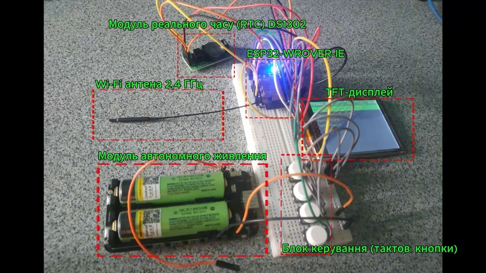
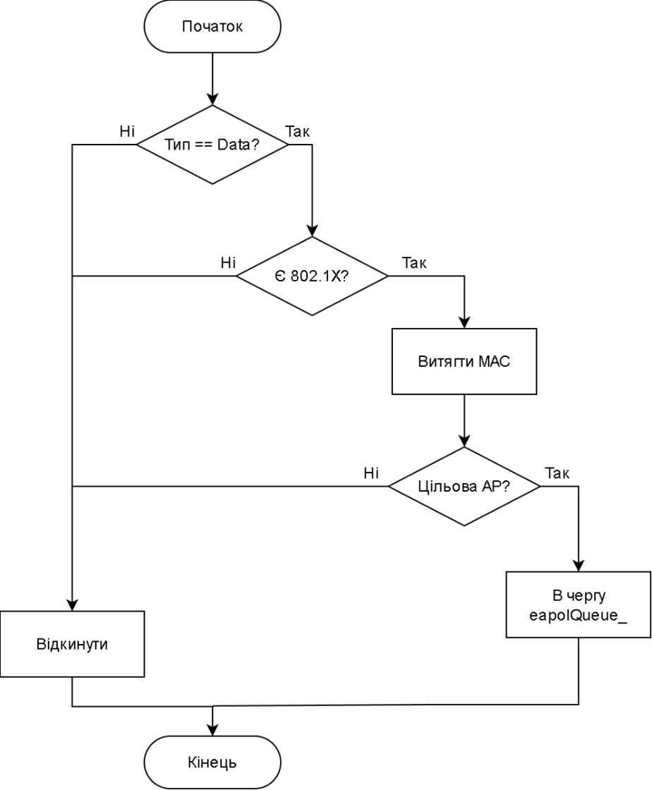
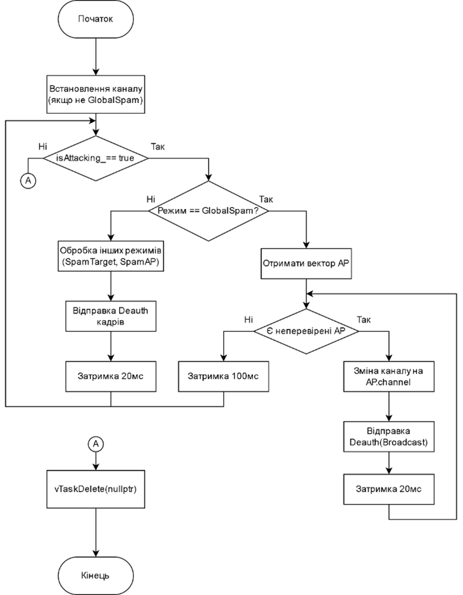
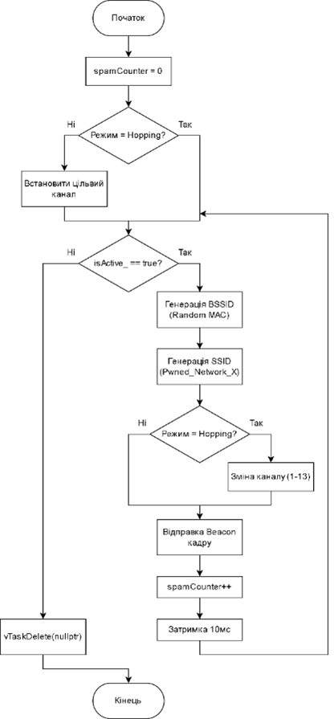
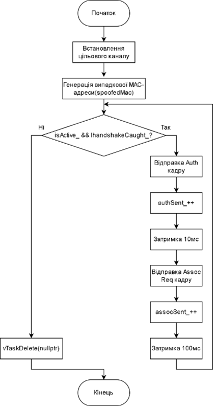

# Computer System for Wi-Fi Security Auditing based on ESP32

This project is a Bachelor's diploma work developed for the National Technical University of Ukraine "Igor Sikorsky Kyiv Polytechnic Institute". It features a portable, autonomous, and high-performance embedded system designed for security auditing of IEEE 802.11 (Wi-Fi) networks.

---

### Project Demonstration

Access the full technical report (Explanatory Note):
[**Full Explanatory Note (Diploma Report)**](Resources/Thesis.pdf)

### Appendices
*   [**Appendix E:** Presentation - Diploma Project](Resources/Docs/Presentation.pdf)
*   [**Appendix A:** Structural Electrical Diagram (ІАЛЦ.467200.005 E1)](Resources/Docs/Appendix_A.pdf)
*   [**Appendix B:** Schematic Electrical Diagram (ІАЛЦ.467200.006 E3)](Resources/Docs/Appendix_B.pdf)
*   [**Appendix C:** Software Architecture (Class Diagram) (ІАЛЦ.467200.007 Д1)](Resources/Diagrams/Appendix_C.png)
*   [**Appendix D:** Navigation & GUI Algorithm (ІАЛЦ.467200.008 Д2)](Resources/Diagrams/Appendix_D.png)

---

## Technical Algorithms
The system utilizes advanced multi-threaded processing to ensure high-performance auditing without packet loss.

### 1. Passive EAPOL Capture

### 2. Global Deauthentication Attack

### 3. Beacon Spam (Network Stress Testing)

### 4. Clientless PMKID Capture

---

## Key Features
*   **Passive Radio Monitoring:** Panoramic packet analysis and detection of hidden networks.
*   **Active Security Auditing:**
    *   **Deauthentication Attacks:** Targeted or broadcasted frame injection.
    *   **PMKID Capture:** Clientless recovery of network keys by exploiting RSN (802.11r) roaming vulnerabilities.
    *   **Beacon Spam:** Simulation of multiple fictitious APs to stress-test network management.
*   **Performance-Optimized UI:** A graphical user interface (GUI) leveraging **DMA (Direct Memory Access)** via the **LovyanGFX** library, ensuring zero-latency updates.
*   **Multithreaded Architecture:** Managed by **FreeRTOS**, ensuring independent execution of RF monitoring, attack generation, and UI rendering.

## Architecture & Design
The software is architected using modern **C++20 standards** with robust design patterns:
*   **Pattern-based Design:** Singleton pattern used for core modules (DeauthManager, WifiSniffer) to ensure safe, serialized access to hardware resources.
*   **Asynchronous Processing:** Use of FreeRTOS queues for non-blocking communication between the radio callback (promiscuous mode) and data analysis tasks.
*   **Efficient Memory Usage:** Utilization of 4MB PSRAM for high-speed packet buffering.

---
*Developed by Denys Manuilov (KV-21) | KPI Igor Sikorsky, 2026.*